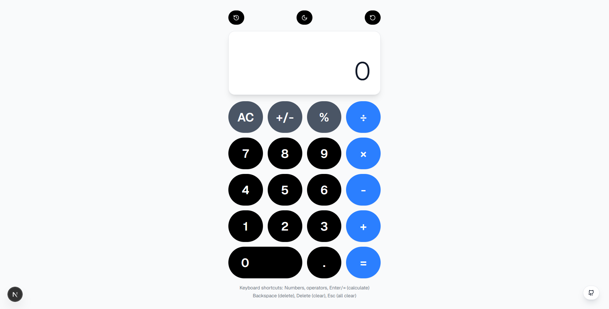

# NextJS Calculator



Not my most impressive project but hey every web dev have made their own calculator, why shouldn't I make one too?

## Installation

1. **Clone the repository:**  
   ```bash
   git clone https://github.com/ghstx9/calc.git  
   cd calc
   ```  

2. **Install dependencies:**
   ```bash 
   npm install  
   npx shadcn@latest init  
   npx shadcn@latest add button  
   npm install lucide-react
   ```  

4. **Run it:**
   ```bash
   npm run dev
   ```